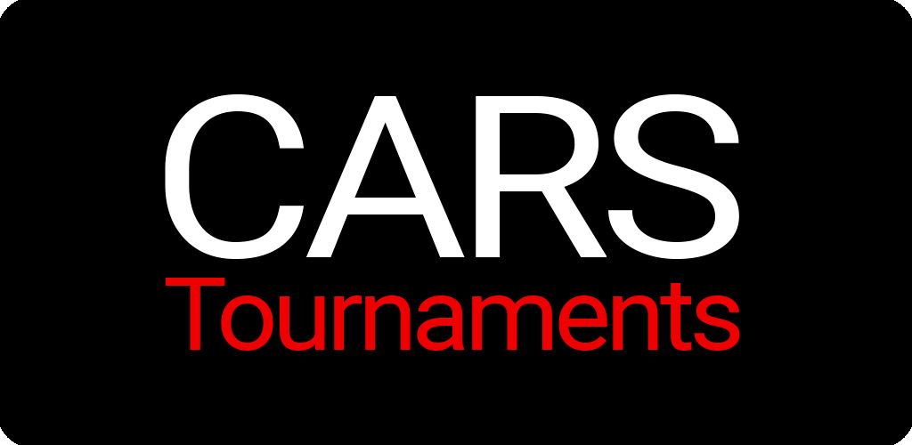

  

  ⚡️ Torneos de coches basados en votos ⚡️
 

## ¿Que es CarsTournaments?

Es una aplicacion en la que podrás participar en torneos de coches. Esos torneos seran votados en cada ronda por los aficionados, hasta llegar al ganador de la final.

## ¿Que usamos?

En CarsTournaments estoy usando diferentes tecnologias.
- Backend: NodeJS, Express, MongoDB
- App: Ionic 6, Angular 14, Capacitor 4
- Admin: Angular 13

## Observaciones

CarsTournaments se encuentra en fase alpha, con lo que tendra algunos errores. Si encuentras alguno y quieres contribuir, estaremos agradecidos de recibir las correcciones.